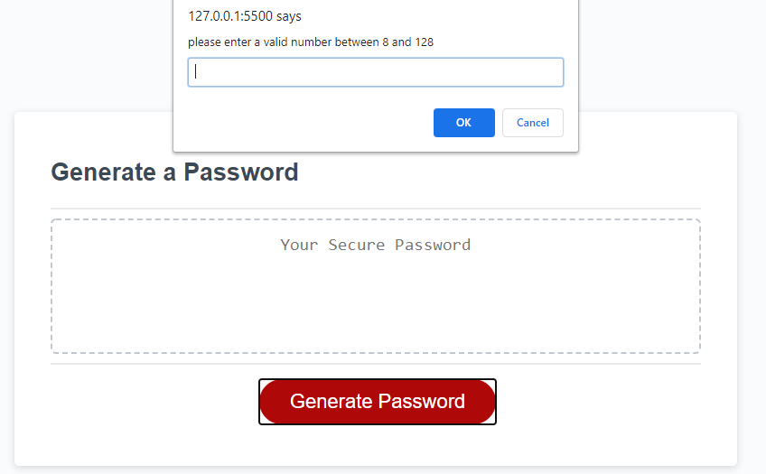

# 03 Home-Work-Assignment

## Password-Generator
Using Javascript created a password generator application
that generated the random password which is very secured
and included lowercase letters,uppercase letters, numbers
and special characters based on the user input through a series 
of prompts and confirm boxes

## Mockup
The below screenshot shows the overview of the application

The flow of the application begins , when the user clicks the generate password button,
it shows the prompt for the user to choose a password length  between 8 and 128

If the user chooses the password length less than 8 or more than 128 a prompt appears to validate user input
or not any valid input

confirm box to include lowercase letters

confirm box to include uppercase letters

confirm box to include numbers

confirm box to include specialCharacters

If the user does not choose either uppercase or lowercase or numbers or special characters
a prompt appers to choose aleast one character type

once the user confirms the series of prompts a random password is generated inside the textArea based on 
user's choice of character type

###Github page 
[password-generator live](https://selvivini.github.io/password-generator/)
